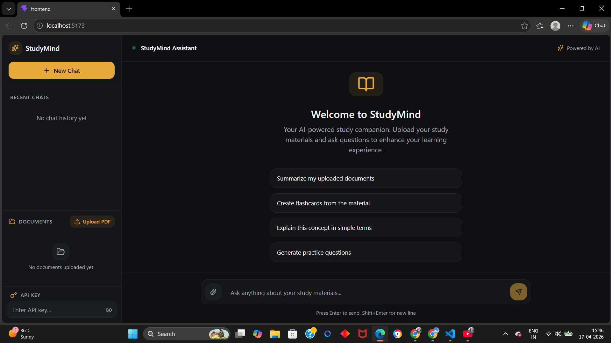
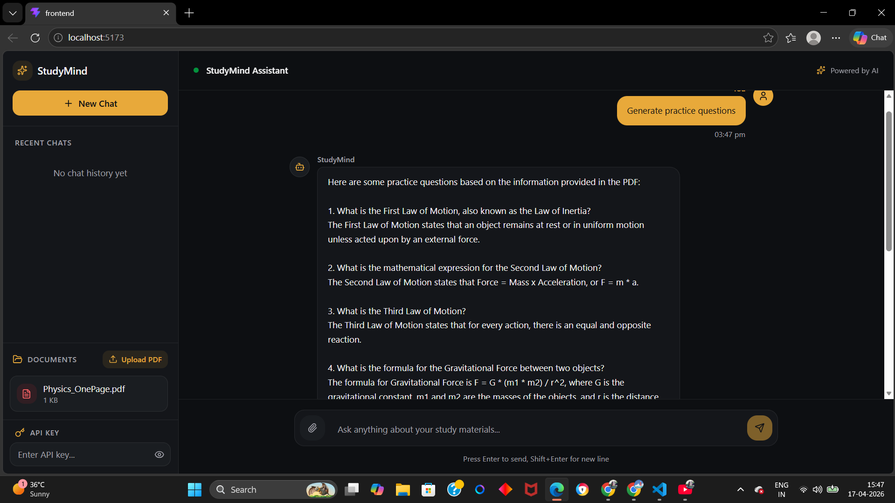

# 📚 AI Study Assistant  

An intelligent AI-powered learning assistant that allows users to interact with PDF documents using natural language queries.

---

## 🚀 Overview  

Students often struggle to quickly extract useful insights from lengthy PDFs.  
This project solves that problem by enabling **AI-driven question answering over documents**, delivering instant, context-aware responses through an interactive chat interface.

---

## 🌐 Live Demo  

👉 Coming soon (deployment in progress)

---

## 📸 Screenshots  



---

## ✨ Features  

- 📄 Upload and process PDF documents  
- 🤖 Ask questions based on document content  
- 🧠 Context-aware AI responses  
- 💬 Chat-style user interface  
- ⚡ Fast and responsive system  

---

## 🚀 Highlights  

- Efficient PDF text extraction and processing  
- Context-aware AI responses using prompt engineering  
- Clean and modular full-stack architecture  
- Real-time frontend-backend interaction  
- Designed for scalability and future AI enhancements  

---

## 🛠 Tech Stack  

### Frontend  
- React (Vite)  
- TypeScript  
- Tailwind CSS  

### Backend  
- Node.js  
- Express.js  
- Multer (file uploads)  
- pdfjs-dist (PDF parsing)  

### AI Integration  
- Anthropic Claude API  

---

## 📂 Project Structure  

```
AI-Study-Assistant/
│
├── backend/
│   ├── routes/
│   ├── uploads/
│   ├── server.js
│
├── frontend/
│   ├── src/
│   │   ├── components/
│   │   ├── App.tsx
│
└── README.md
```

---

## ⚙️ Setup Instructions  

### 1. Clone Repository  

```
git clone https://github.com/akshadawagadare/ai-study-assistant.git
cd ai-study-assistant
```

---

### 2. Backend Setup  

```
cd backend
npm install
```

Create a `.env` file:  

```
CLAUDE_API_KEY=your_api_key_here
```

Run the server:  

```
node server.js
```

Backend runs on:  
http://localhost:5000  

---

### 3. Frontend Setup  

```
cd frontend
npm install
npm run dev
```

Frontend runs on:  
http://localhost:5173  

---

## 🔌 API Endpoints  

### Upload PDF  
```
POST /upload
```

### Ask Question  
```
POST /upload/ask
```

Request Body:
```json
{
  "question": "Your question here"
}
```

---

## 🧠 How It Works  

1. User uploads a PDF  
2. Backend extracts text using pdfjs  
3. Text is processed and passed as context  
4. User submits a query  
5. AI generates a context-aware response  
6. Answer is displayed in chat interface  

---

## 🧩 AI Implementation Details  

- Uses prompt engineering to inject document context into AI queries  
- Ensures responses are relevant to uploaded content  
- Designed to be extendable to **RAG (Retrieval-Augmented Generation)**  

---

## 🎯 Key Learnings  

- Handling file uploads in Node.js  
- Parsing and processing PDF data  
- Integrating AI APIs into real-world applications  
- Building scalable full-stack systems  
- Managing frontend-backend communication  

---

## 🚧 Future Improvements  

- 🔍 Implement RAG with vector database (Pinecone / FAISS)  
- 📚 Multi-document support  
- 💾 Chat history with database (MongoDB)  
- 🔐 User authentication system  
- ⚡ Streaming AI responses  

---

## ⚠️ Notes  

- Ensure backend is running before starting frontend  
- Upload a PDF before asking questions  
- Never expose API keys in frontend  

---

## 👨‍💻 Author  

**Akshada Wagadare**  

---

## ⭐ Support  

If you found this project useful, consider giving it a ⭐ on GitHub!